# Deplying a Basic VPC and Local File with Terraform

## Set Up Terraform Project

In the terminal, navigate to your working path and run the following commands:

### Create Project Directory

```bash
mkdir week-7 && cd week-7
```

### Create Terraform Subdirectory

```bash
mkdirk terraform && cd terraform
```

### Create Project Files

```bash
touch 00-authentication.tf \
	01-vpc.tf \
	02-local-files.tf \
	03-outputs.tf
```

### Initialize Terraform

Initialize terraform by running:

```hcl
terraform init
```

---

## Open the Project in VS Code

From the terraform subdirectory, run:

```bash
code .
```

---

## Find Necessary Terraform Documentation

Go to <https://registry.terraform.io/> and retrieve documentation for the most recent versions of the Google and Local providers. <br></br>
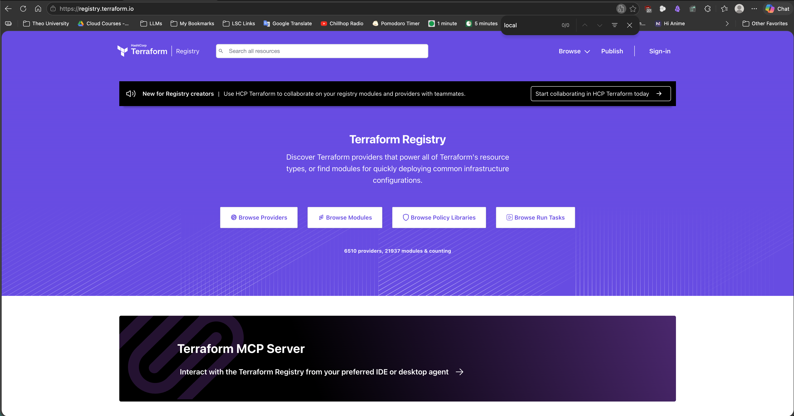

Click "Browse Providers"
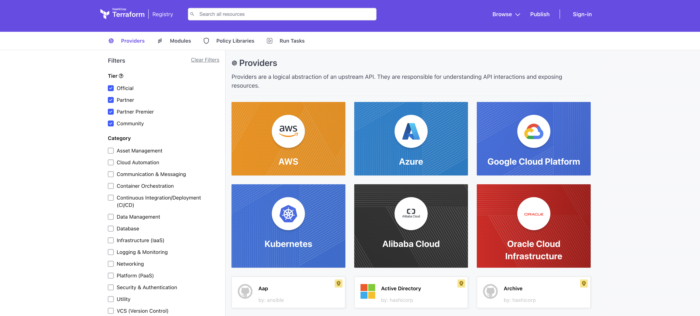

> ![TIP]<br>
> You can navigate the Terraform registry by clicking "Browse Providers." From there, you can filter providers or search as needed.


Open each provider's documentation in a new tab:
- Google( Google Cloud Platform, by Hashicorp)
  - 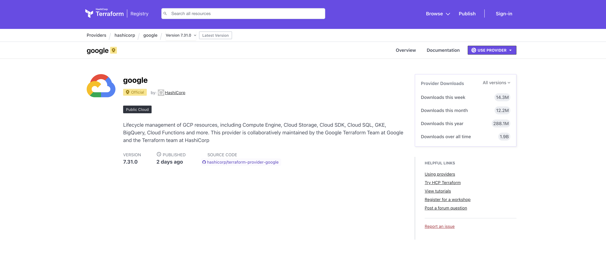

- Local (Local, by Hashicorp)
  - 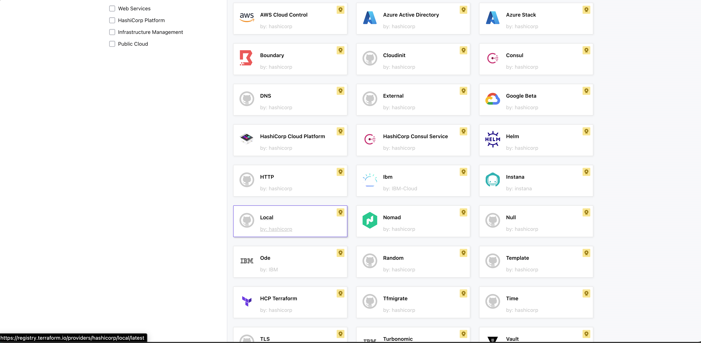

---

## Develop Terraform Code for the Project

Use the Terraform provider documentation and follow the steps below to develop Terraform code for the project

### Add Required Providers in `00-authentication.tf`

#### Google Terraform Provider

Open the Google Terraform provider and click the "USE PROVIDER" dropdown.

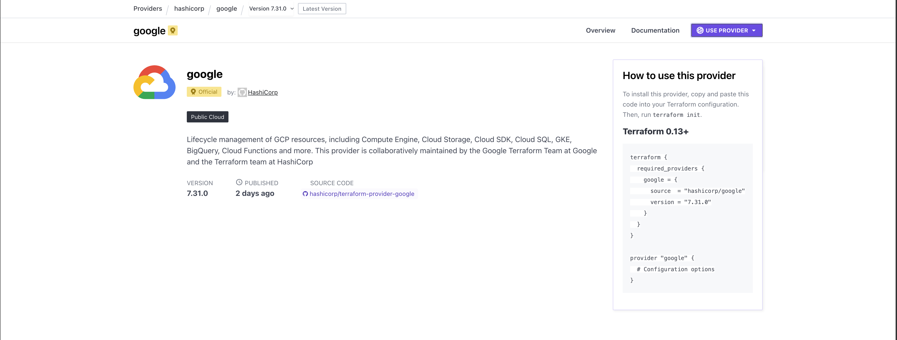


Copy the entire code block and paste it into `00-authentication.tf`

```hcl
terraform {
  required_providers {
    google = {
      source  = "hashicorp/google"
      version = "7.31.0"
    }
  }
}

provider "google" {
  # Configuration options
}
```

Edit the `provider "google"` block by adding `project` and `region` arguments. The values are your project ID and deployment region, respectively.

Example Google provider configuration

```hcl
  project = "kirk-devsecops-sandbox"
  region  = "us-central1"
```

#### Hashicorp Local Provider

Open the Hashicorp Local provider and click the "USE PROVIDER" dropdown.

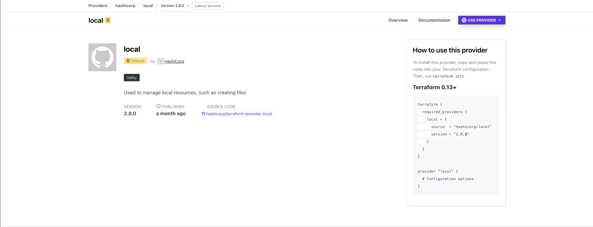

Copy only the `local = {}` argument and add it the `required providers` block

```hcl
    local = {
      source  = "hashicorp/local"
      version = "2.8.0"
```

### Review `00-authentication.tf`

Your file configuration should be similar to this:
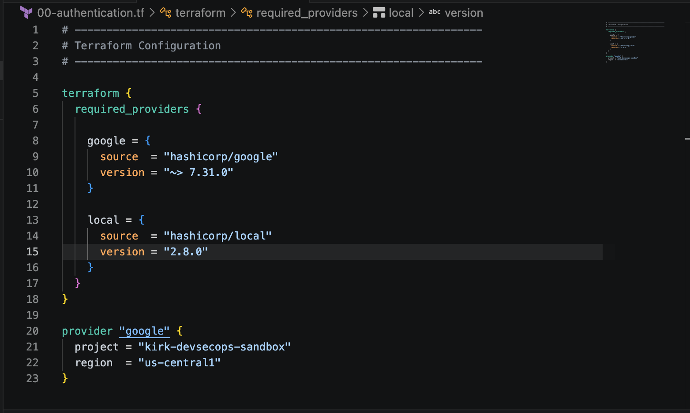 

>![TIP]<br>
> Run `terraform validate` to check your configuration. If there are any errors, fix them before proceeding.

### Add VPC Resource in `01-vpc.tf`

In the Google Cloud Cloud provider documentation, search for `google_compute_network` and click the `google_compute_network` resource to view documentation for the resource.

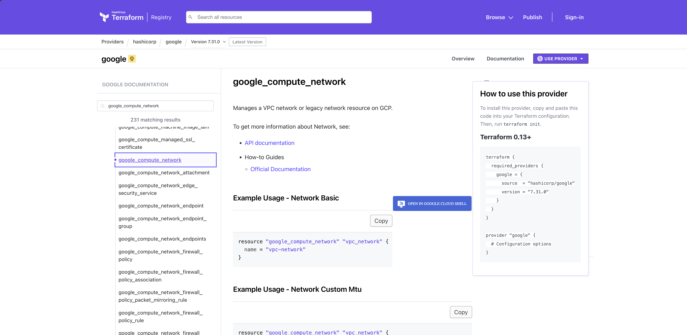 


Copy the code block for "Example Usage - Network Basic," paste it into VS code, and save the file

```hcl
resource "google_compute_network" "vpc_network" {
  name = "vpc-network"
}
```

> ![NOTE]<br>
> Edit the resource name `vpc_network` and the name attribute `vpc-network` as you see fit.

### Review `01-vpc.tf`

Your file configuration should be similar to this:
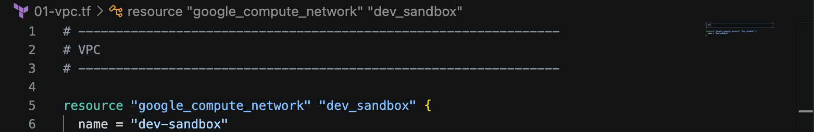 

>![TIP]<br>
> Run `terraform validate` to check your configuration. If there are any errors, fix them before proceeding.

### Develop Code for `02-local-files.tf`

In the Hashicorp Local provider documentation, search for `local_file` and click the `local_file` resource to view documentation for the resource.

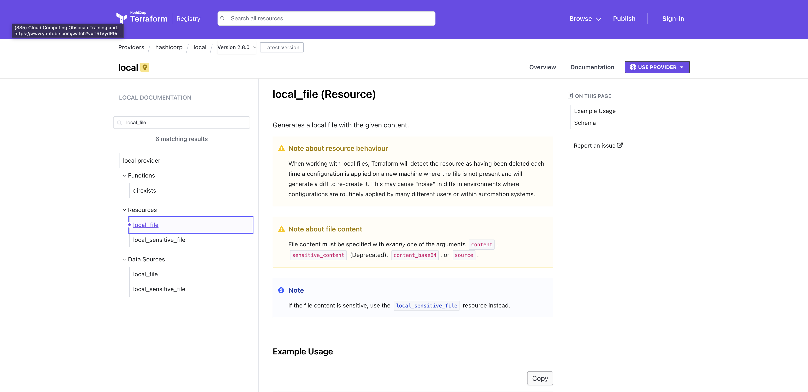 


Copy the code block for "Example Usage" and paste it into VS code.

```hcl
resource "local_file" "foo" {
  content  = "foo!"
  filename = "${path.module}/foo.bar"
}
```

Change the resource name from `"foo"` to `"favorite_food"`.

Change the argument value for `content` from `"foo!"` and updated it with your favorite food. For example, `"lamb rib chops"`

In the `filename` argument, change the value to `${path.module}/rendered/favorite-food.txt"`

This saves the contents of the `local_file` resource to a file called `favorite-food.txt`

### Review `02-local-files.tf`

Your file configuration should be similar to this:
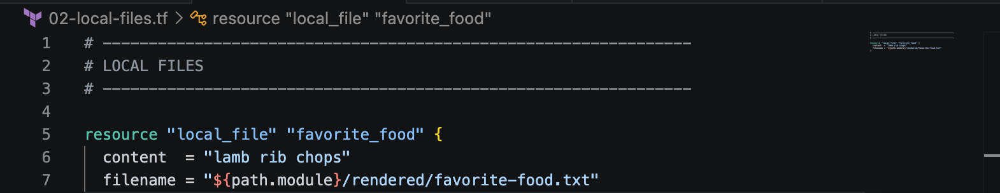 

>![TIP]<br>
> Run `terraform validate` to check your configuration. If there are any errors, fix them before proceeding.


### Develop Code for `03-output.tf`

An output block reference is needed to produce outputs in Terraform. Use an output block like the one below to output information for the `google_compute_network` VPC resource.

> ![NOTE]<br>
> In the `value` argument, change the reference so it matches your VPC resource name. You can find the name.

```hcl
output "vpc_name" {

description = "Name of the VPC"

value = google_compute_network.network_vpc.name

}
```

View the Terraform [output block reference documentation](https://developer.hashicorp.com/terraform/language/block/output) for additional information about constructing arguments in output blocks.

### Review `03-outputs.tf`

Your file configuration should be similar to this:
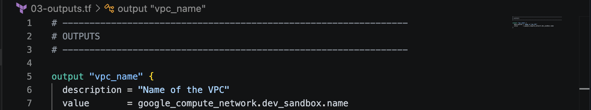 

>![TIP]<br>
> Run `terraform validate` to check your configuration. If there are any errors, fix them before proceeding.

---

## Format all Terraform Files (Optional)

Run `terraform fmt -recursive` to properly format all files in the project.

>![NOTE]<br>
> `terraform fmt` formats Terraform files in Hashicorp Configuration Language (HCL) format, Hashicorps standardized format and style. If the return is empty, your files are already properly formatted.

Example Results
 

---

## Run the Terraform Deployment Process

### Terraform Validate

Run `terraform validate` to check your configuration. If there are any errors, fix them before proceeding.

 


### Terraform Plan

Run `terraform plan` to generate a plan. If Terraform reports any errors, fix them before proceeding.

 


### Terraform Apply

Run `terraform apply` to excecute the deployment process. When prompted, type `yes` to confirm deployment. If Terraform reports any errors, fix them before proceeding.

 


## Confirm Successful Deployment

### Confirm `Apply complete!` and `Outputs:`

If successful, Terraform should return a deployment success message with outputs.

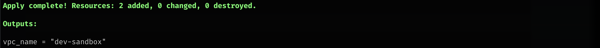 


### Confirm Creation of the VPC Resource in GCP Console

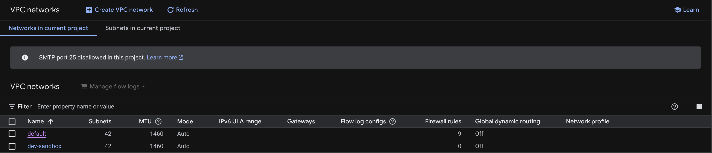 


### Confirm Creation of `rendered` Directory and `favorite-food.txt`

Run the following commands to confirm that the  `rendered` directory was created:

```bash
ls
```

Confirm the `rendered` directory was created.


If the directory doesn't exist, double check your current path and review the `filename` argument for the `"favorite_food"` resource in  `02-local-files.tf`. Fix any issues before proceeding.

Naviagate to the `rendered` directory and confirm that a file named `favorite-food.txt` was created.

```bash
cd rendered & ls
```
ls


If the file doesn't exist, double check your current path and review the `filename` argument for the `"favorite_food"` resource in  `02-local-files.tf`.

---

## Lab Cleanup

### Destroy the Deployment

Run `terraform destroy` to remove all resources created by this lab. When prompted, type `yes` to confirm destruction.

If successful, Terraform should return a destruction success message.


---

## Resources Used
- [Terraform Registry](https://registry.terraform.io/)
- [Terraform Google Provider](https://registry.terraform.io/providers/hashicorp/google/latest)
- [Terraform Local Provider](https://registry.terraform.io/providers/hashicorp/local/latest)
- [Terraform - Google Documentation: google_compute_network](https://registry.terraform.io/providers/hashicorp/google/latest/docs/resources/compute_network)
- [Terraform - Local Documentation: local_file (Resource)](https://registry.terraform.io/providers/hashicorp/local/latest/docs/resources/file)
- [Terraform - Output Block Reference](https://developer.hashicorp.com/terraform/language/block/output)
- [Terraform Style Guide](https://developer.hashicorp.com/terraform/language/style#code-formatting)
- [Terraform fmt Command](https://developer.hashicorp.com/terraform/cli/commands/fmt)